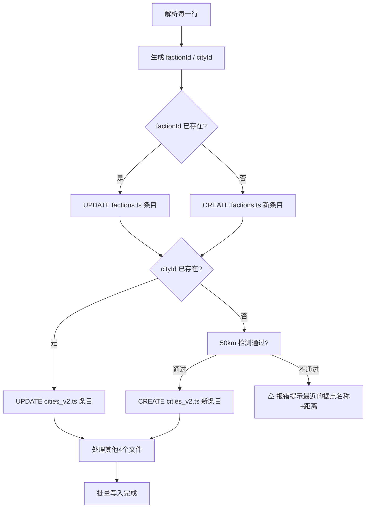

# 批量文本导入方案（替代全 UI 编辑器合并）

## 输入格式

用户粘贴的文本（每行一个势力+据点）：

```
势力，咄陆，据点：孛罗城，坐标：44.9, 82.0
势力，阿史那，据点：碎叶城，坐标：42.80, 75.2667
势力，突骑施，据点：达罗斯，坐标：42.90, 75.20
```

**字段规则：**

| 字段 | 标记词 | 取值 | 说明 |
|------|--------|------|------|
| 势力名 | `势力` 或 `势力：` | "咄陆" | 1-2字势力简称 |
| 据点 | `据点` 或 `据点：` | "孛罗城" | 据点中文全名 |
| 坐标 | `坐标` 或 `坐标：` | "44.9, 82.0" | lat, lng |
| 旗号 | 可选 `旗号` 或 `旗号：` | "咄陆" | 省略则自动按规则生成 |

**旗号自动生成规则：**
- 势力名1字 → 旗号 = 那1字（如 "汉" → "汉"）
- 势力名2字 → 旗号 = 那2字（如 "咄陆" → "咄陆"）
- 势力名3字+ → 旗号 = 前2字（如 "阿史那" → "阿史"）

## 自动识别逻辑（Create vs Update）



## 涉及的修改

### 1. 扩展 [`vite.config.ts`](../vite.config.ts) 

**新增端点：** `POST /api/batch-import`

```typescript
// 请求体
interface BatchImportRequest {
    entries: Array<{
        factionName: string;     // 势力名
        flagText: string;        // 旗号（1-2字，自动生成）
        cityName: string;        // 据点名
        lat: number;             // 纬度
        lng: number;             // 经度
        isNewFaction: boolean;   // true=新建 / false=更新
        isNewCity: boolean;      // true=新建 / false=更新
        factionId: string;       // 自动生成
        cityId: string;          // 自动生成
    }>;
}
```

**新增辅助函数：**
- `serverReplaceInFile(text, keyword, targetId, newLine)` — 查找 {id:'xxx'} 块并替换
- `serverReplaceDisplayName(text, keyword, targetId, newLine)` — SandboxDisplayNames 格式不同，需单独处理
- `readCityFileForProximityCheck()` — 读取 cities_v2.ts 检查 50km 间距

**复用已有函数：**
- `serverInsertIntoStructure()` — 追加模式（新建时用）

### 2. 修改 [`FactionEditor.ts`](../src/core/FactionEditor.ts)

**新增 UI 元素（在现有面板底部追加）：**

```
┌─────────────────────────────┐
│ 📋 批量导入                 │
│ ┌───────────────────────┐   │
│ │势力，咄陆，据点：孛罗城 │   │
│ │坐标：44.9, 82.0       │   │
│ │                       │   │
│ │势力，XXX，据点：XXX    │   │
│ │坐标：XX, XX           │   │
│ └───────────────────────┘   │
│ [🔍 解析预览] [🚀 批量保存]│
│ ── 解析结果 ──              │
│ ✅ 咄陆 → 新建              │
│ ✅ 孛罗城 → 新建  (距最近:  │
│    伊犁 321km ✓)            │
└─────────────────────────────┘
```

**新增方法：**
- `parseBatchInput(text: string)` — 解析文本，逐行提取字段
- `previewBatch(entries)` — 显示每个条目的 create/update 判断结果 + 50km检测
- `saveBatch()` — POST 到 `/api/batch-import`

### 3. 颜色自动分配（新建势力时）

[`factions.ts`](../src/data/factions.ts) 每个势力需要 color 字段。新建时自动分配：

```typescript
const PREDEFINED_COLORS = [
    '#7A8A6B', '#6B8A7A', '#8A7A6B', '#6B7A8A', '#8A6B7A',
    '#7A6B8A', '#6B8A8A', '#8A8A6B',
];
// 取模循环
```

## 自动 ID 生成规则

| 字段 | 规则 | 示例 |
|------|------|------|
| factionId | `chineseToId(势力名)` + 冲突检测 | "咄陆" → "duolu" |
| cityId | `city_ + chineseToId(据点名)` + 冲突检测 | "孛罗城" → "city_boluocheng" |

冲突检测复用 [`FactionEditor.disambiguateFactionId()`](../src/core/FactionEditor.ts:41) 和 [`disambiguateCityId()`](../src/core/FactionEditor.ts:52)。

## 实现步骤

| 步骤 | 文件 | 内容 |
|------|------|------|
| 1 | [`vite.config.ts`](../vite.config.ts) | 新增 `POST /api/batch-import` 端点 + `serverReplaceInFile()` / `serverReplaceDisplayName()` |
| 2 | [`FactionEditor.ts`](../src/core/FactionEditor.ts) | 添加批量导入 UI（textarea + 解析预览 + 保存按钮）+ `parseBatchInput()` 方法 |
| 3 | — | 验证 TypeScript 编译 |
| 4 | — | 手动测试：粘贴文本 → 自动识别新建/修改 → 检查5个文件 |
