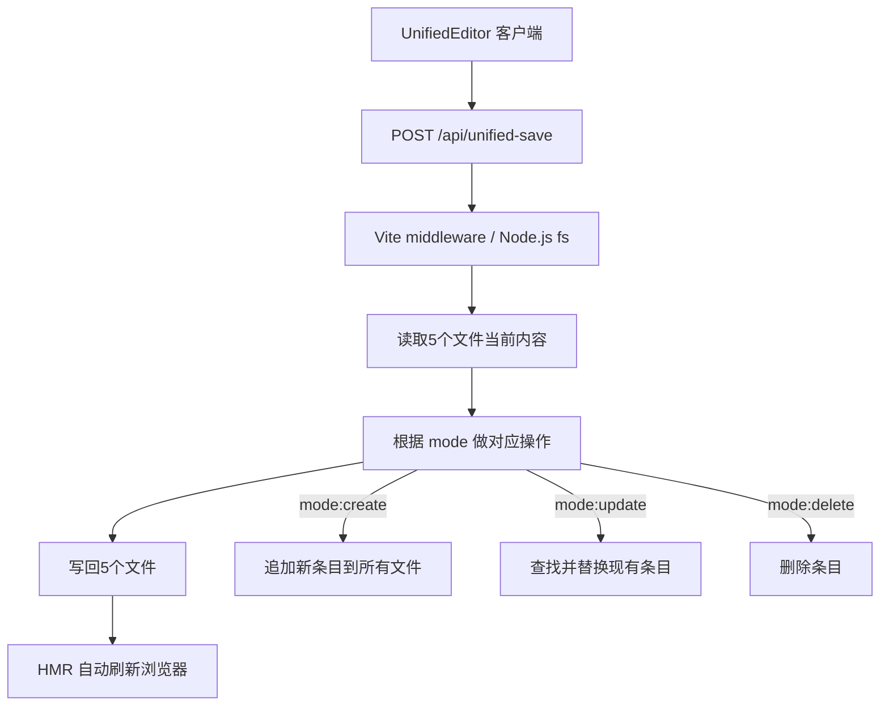
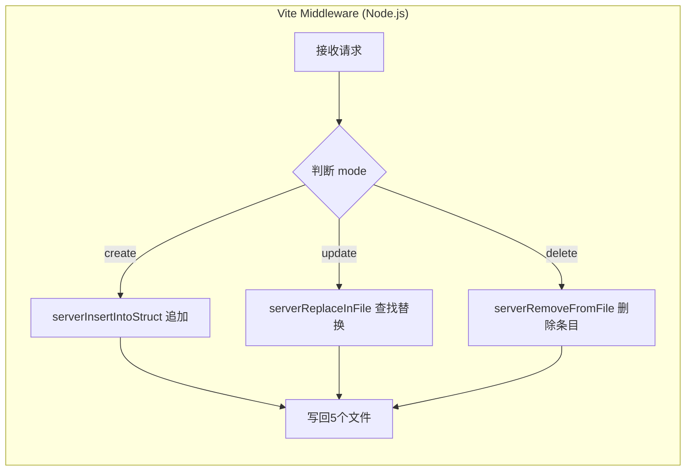

# 据点·势力统一编辑器 合并方案

## 问题分析

当前有两个分离的编辑器：

| 功能 | [`CityEditor`](../src/core/CityEditor.ts) (1432行) | [`FactionEditor`](../src/core/FactionEditor.ts) (631行) |
|------|:---:|:---:|
| 写文件方式 | 浏览器 FSA API（脆弱·Windows锁·权限丢失） | POST → Vite middleware → Node.js fs（稳定·HMR自动刷新） |
| 覆盖文件 | 仅 `cities_v2.ts` | 全部5个文件 |
| 新建势力 | ❌ | ✅ 自动派ID·短名·旗号 |
| 编辑已有城 | ✅ 坐标·类型·兵力 | ❌ 仅新建首都 |
| 编辑已有势力 | ❌ | ❌ 仅新建 |
| 删除 | ✅ 有STARTING_CAPITALS警告 | ❌ |
| 删除势力 | ❌ | ❌ |

## 核心设计

### 架构图



### 保存机制选择

**选 POST + Vite middleware**（弃用 FSA），原因：
- FSA 在 Windows 上频繁文件锁冲突
- FSA 跨会话权限需要用户重新选择文件
- Vite middleware 写文件触发 HMR 自动刷新
- FactionEditor 已证明此方案稳定

### 新增/扩展的 API 端点

#### 1. [`vite.config.ts`](../vite.config.ts) — 扩展 save-faction → unified-save

**新增端点：** `POST /api/unified-save`

```typescript
interface UnifiedSaveRequest {
    mode: 'create' | 'update' | 'delete';
    // 公共
    id: string;            // faction ID (ashina / tujishi...)
    name: string;          // 势力中文全名
    shortName: string;     // 旗号短名 (1-2字)
    flagType: 'RANDOM' | 'PNG';
    flagPngPath: string;
    color: string;         // hex color
    // 城市信息
    cityId: string;
    cityName: string;
    cityLat: number;
    cityLng: number;
    cityType: 'small_city' | 'medium_city' | 'big_city';
    cityTroops: number;
    isCapital: boolean;    // 是否是首都
    // 删除模式
    deleteCities: boolean; // 删除势力时是否连带删除关联城市
}
```

**扩展 `saveFactionFiles()` → `unifiedSaveFiles()`**



新增辅助函数：

| 函数名 | 功能 |
|--------|------|
| `serverReplaceInFile(text, keyword, oldId, line)` | 查找 `{id: 'xxx'}` 块并替换 |
| `serverRemoveFromFile(text, keyword, targetId)` | 查找并删除指定 ID 的块 |

### 2. 统一编辑器 UI 布局

```
┌────────────────────────────────────────────┐
│ 🏛 据点·势力统一编辑器  [×]  [⠿ 拖动]      │
├────────────────────────────────────────────┤
│ [➕ 新建模式] [✏️ 编辑模式] [🗑️ 删除模式]   │
├────────────────────────────────────────────┤
│ ┌─ 势力信息 ────────────────────────────┐  │
│ │ 中文全名: [阿史那______________]       │  │
│ │ 自动 ID:  ashina ✓                   │  │
│ │ 旗号短名: [阿史__] (1-2字) ✓          │  │
│ │ 势力颜色: [■ #7A8A6B] [🎨 选色]      │  │
│ │ 旗帜样式: ● RANDOM ○ PNG [______]    │  │
│ └──────────────────────────────────────┘  │
│ ┌─ 据点信息 ────────────────────────────┐  │
│ │ 城名: [碎叶城__________]               │  │
│ │ 自动 ID: city_suiye ✓                │  │
│ │ 坐标: [42.80] [75.2667] [📍取点]      │  │
│ │ 类型: [small_city ▼] 兵力: [10000]   │  │
│ │ 文化区: [自动判定: 中亚(central_asia)] │  │
│ │ ☑ 设为首都 (STARTING_CAPITALS)        │  │
│ └──────────────────────────────────────┘  │
│ ┌─ 5步配置预览 ───────────────────────┐  │
│ │ ✅ factions.ts                       │  │
│ │ ✅ cities_v2.ts                      │  │
│ │ ✅ STARTING_CAPITALS                 │  │
│ │ ✅ factionFlagMap                    │  │
│ │ ✅ SandboxDisplayNames               │  │
│ └──────────────────────────────────────┘  │
│ [👁️ 预览]  [🚀 一键保存 写5文件]       │
├────────────────────────────────────────────┤
│ 状态: 就绪                                 │
└────────────────────────────────────────────┘
```

### 3. 模式切换逻辑

```
mode = 'create':
  → 清空表单（仅保留可能继承的值）
  → "新建" 按钮可用
  → 自动生成 factionId + cityId（冲突检测）
  → 全部5个文件追加条目

mode = 'edit':
  → 用户点击地图上的城市或势力名 → 加载到表单
  → ID 锁定（不可修改）
  → "更新" 按钮可用
  → 5个文件查找替换（by ID）

mode = 'delete':
  → 加载目标势力
  → 警告：该势力有 N 个关联城市
  → 选项：仅删势力条目 / 同时删所有城市
  → 如果是 STARTING_CAPITALS，特别警告
```

## 实现步骤

### 步骤 1: 扩展 Vite middleware [`vite.config.ts`](../vite.config.ts)

**文件修改：** 在 `/api/save-faction` 之后添加 `/api/unified-save`

**新增内容：**
1. `unifiedSaveFiles()` — 主干分发函数（根据 mode 调用不同策略）
2. `serverReplaceInFile(text, keyword, oldId, line)` — 查找替换函数
3. `serverRemoveFromFile(text, keyword, targetId)` — 删除函数
4. 在 `POST /api/unified-save` 端点中编排调用

### 步骤 2: 创建 `UnifiedEditor.ts`

**新文件：** `src/core/UnifiedEditor.ts`

**继承的功能列表：**

| 来源 | 功能 | 说明 |
|------|------|------|
| FactionEditor | `chineseToId()` | 中文名→snake_case ID |
| FactionEditor | `disambiguateFactionId()` | 冲突检测+后缀 |
| FactionEditor | `disambiguateCityId()` | 城市 ID 冲突检测 |
| FactionEditor | `readForm()` | 表单读取 |
| FactionEditor | 5步 checklist | 配置预览 |
| FactionEditor | 旗号样式选择 | RANDOM/PNG |
| FactionEditor | POST save | 稳定写入模式 |
| CityEditor | 地图取点 | 📍 点击取坐标 |
| CityEditor | Nominatim 搜索 | 🔍 地理编码搜索 |
| CityEditor | 坐标粘贴 | 📋 右键取点粘贴 |
| CityEditor | 50km 邻近检测 | 间距合规检查 |
| CityEditor | Region 自动判定 | 文化区域检测 |
| CityEditor | 预览 | 👁️ 临时显示在地图 |
| CityEditor | delete with warning | 删除前检查 STARTING_CAPITALS |
| CityEditor | 沙盒陷阱检测 | 4项检查(factionFlagMap等) |

**新增功能：**
- 势力颜色选择器（基于 [`factions.ts`](../src/data/factions.ts) 现有的 color 字段）
- 编辑模式：查找到已有条目 ID 后替换
- 删除模式：从5个文件中移除条目
- 首都切换开关（控制是否写入 GameApp.ts 的 STARTING_CAPITALS）

### 步骤 3: 更新 [`GameApp.ts`](../src/core/GameApp.ts)

**修改点：**
1. 替换 `cityEditor` 为 `unifiedEditor`
2. 更新 `toggle-editor-city` 事件处理
3. 更新 `GameInputManager` 传参

### 步骤 4: 保留 FactionEditor 作为兼容层（可选）

FactionEditor 可以保留但改为调用 UnifiedEditor 的内部方法，或逐步废弃。

## 文件名和类名

| 项目 | 名称 |
|------|------|
| 新文件 | `src/core/UnifiedEditor.ts` |
| 类名 | `UnifiedEditor`（单例模式） |
| API 端点 | `POST /api/unified-save` |
| 管理器 | 复用 `UnifiedEditorManager` |

## 风险与注意事项

1. **编辑模式下 ID 锁定**：编辑已有条目时，factionId 和 cityId 不可修改（否则破坏引用）
2. **删除势力时的城市处理**：一个势力可能有多个城市（例如唐朝有数十个），删除势力时需要逐一确认或提供批量迁移选项
3. **并发写入**：Vite middleware 处理请求是同步的，不会有两个写请求同时到达（单线程 Node.js）
4. **FactionEditor 废弃**：合并后 FactionEditor 不再需要，但从 CityEditor 中移出 `FactionEditor.getInstance().toggle()` 按钮引用

## 时间线

1. 扩展 `/api/unified-save` — 新增 `serverReplaceInFile` / `serverRemoveFromFile`
2. 创建 `UnifiedEditor.ts` — 核心 UI 和逻辑
3. 更新 `GameApp.ts` — 注册新编辑器替代 CityEditor
4. 编译验证和手动测试
