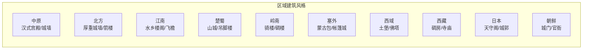

# 据点视觉风格设计方案

## 一、现状概览

当前项目中"据点"（城市/关隘/渡口/古战场）的视觉体系已存在以下结构：

### 1.1 据点类型分层

| 层级 | 类型 | 示例 | 用途 |
|------|------|------|------|
| T0 | `big_city` 大城 | 长安、洛阳、成都 | 历代国都，10座 |
| T1 | `medium_city` 中城 | 省会、府治 | 区域中心 |
| T2 | `pass` 关隘 | 虎牢关、潼关、函谷关 | 战略要冲 |
| T2 | `ferry` 渡口 | 港口、渡口 | 水路节点 |
| — | `battlefield` 古战场 | 巨鹿、官渡 | 野战地点，无驻军 |
| T4 | `small_city` 小城 | 周边据点 | 小型城邑 |

### 1.2 现有渲染结构

每个据点的视觉组成（来自 `TerritorySystem.ts`）：

```
┌──────────────────┐
│     旗帜杆        │  ← S10QZ/1-1.png (pole)
│  ┌────────────┐  │
│  │  旗帜布     │  │  ← 势力旗帜（随机或指定）
│  │  势力文字   │  │  ← DynamicFlagTextGenerator 生成
│  └────────────┘  │
│  ┌────────────┐  │
│  │  城市建筑图  │  │  ← RegionSystem 根据地域分配
│  └────────────┘  │
│  城市名称 + 兵力  │  ← 文字标签
└──────────────────┘
```

### 1.3 现有素材来源

- **旗帜/杆/装饰**：`/SUCAI/S10QZ/` 目录（来自光荣《三国志》系列素材）
- **城市建筑图**：`/public/cities/` 目录，按`地域_规模.png`命名（如 `central_big.png`）
- **特定大城专用图**：`/public/cities/zhiding/` 目录（如 `changan.png`, `luoma.png` 等）
- **军团兵卒**：`/SUCAI/S10DB/` 目录（8方向行走图）

---

## 二、设计原则

基于项目的定位 **"历史大乱斗·黑金史诗"**，据点图标应遵循以下原则：

### 原则1：历史真实性

每个据点反映其时代和地域的建筑风格。中原不同于江南，汉城不同于塞外。

### 原则2：视觉层次清晰

玩家在缩放地图时能一眼分辨：
- **大城 vs 关隘 vs 渡口 vs 古战场**
- **哪个势力控制**（靠旗帜颜色）
- **是否重要**（靠尺寸和视觉重量）

### 原则3：风格统一 + 地域差异化

整体美术风格统一（如像素风/水墨风/手绘风），同时18个地域各有特色。

### 原则4：缩放友好

- Zoom 7: 隐藏
- Zoom 8: 0.5x
- Zoom 9: 1.0x
- Zoom >9: 递增

在低缩放级别需要简化，高缩放级别展示细节。

---

## 三、推荐方案（按优先级排序）

### 方案A：日式像素城郭风（推荐度 ★★★★★）

**风格描述**：
延续当前 S10QZ/S10DB 系列的日式像素风格（光荣《三国志》系列经典画风），但**统一重绘**所有地域的城市图标，确保风格一致。

**地域差异化**：



**优点**：
- 与现有单位素材（S10DB兵卒）风格完全匹配
- 像素风格性能开销小，易于在 Leaflet 上渲染
- 光荣《三国志》系列已有成熟的城郭设计可参考
- 用户可能已熟悉并喜欢这种风格

**缺点**：
- 需要大量绘制工作（18地域 × 5类型 = 90+ 图标）
- 像素风格在4K屏上可能显得模糊（需矢量缩放）

### 方案B：水墨手绘风（推荐度 ★★★★）

**风格描述**：
采用中国传统水墨/工笔白描风格，城市以剪影或线稿形式呈现。黑白为主，势力色用旗帜/光晕表现。

**参考**：
- 《全面战争：三国》的政略地图城市图标
- 宋代《千里江山图》中的城郭画法

**优点**：
- 极强历史感，符合"历史大乱斗"定位
- 黑白剪影与势力彩色旗帜形成强烈对比
- 艺术风格独特，有辨识度

**缺点**：
- 与现有 S10DB 像素单位风格不统一
- 手绘风格在大量据点（100+）时难以保持一致性

### 方案C：纯 SVG 矢量图标（推荐度 ★★★★）

**风格描述**：
用 SVG 矢量图形替代所有位图，城市图标简化为符号化的城堡/关隘/渡口等图形，用颜色和徽章表示势力归属。

**优点**：
- 无限缩放无锯齿
- 文件体积小
- 易于程序化生成（颜色、大小、状态）
- 与 Leaflet 原生兼容性好

**缺点**：
- 缺乏历史感和细节
- 容易显得"太游戏化"（像桌游TOKEN）

### 方案D：3D 渲染俯视图（推荐度 ★★★）

**风格描述**：
为每个地域制作 3D 模型的俯视图或 45° 俯角渲染图，类似《文明》系列的城市图标。

**优点**：
- 视觉冲击力强
- 能清晰展示建筑结构

**缺点**：
- 开发成本极高
- 与现有的 2D 像素单位不匹配
- 性能开销大

---

## 四、推荐组合方案

我**强烈推荐方案A（日式像素城郭风）**，原因如下：

### 核心理由

1. **风格一致性**：项目中所有单位（兵卒行走图、旗帜、人物头像）均来自光荣《三国志》系列素材，像素风格已是项目的视觉底色
2. **技术成熟**：当前系统已按18地域×5类型建好了完整的图片路径体系（`STYLE_MAP`），只需要替换实际图片文件
3. **可扩展性**：新加的势力/城市只需要对应地域的图片，无需单独定制
4. **性能优异**：像素图在 Canvas/Leaflet 上表现极佳

### 具体的实施层次

| 优先级 | 内容 | 工作量 |
|--------|------|--------|
| P0 | **18地域的基础建筑图**（big/medium/small/pass/ferry 各1张） | ~90张图 |
| P1 | **10大古都的特制图**（长安、洛阳、开封、北京等已有部分） | ~10张图 |
| P2 | **周边地区特制**（日本天守阁、朝鲜官衙、罗马竞技场等） | ~15张图 |
| P3 | **旗帜系统优化**（现有旗帜杆+布+文字的合成逻辑已完善） | 无需额外工作 |
| P4 | **古战场图标**（已用 `/assets/UI/battlefield_icon.svg`，可选升级） | 少量 |

### 图片规格建议

| 参数 | 值 |
|------|------|
| 分辨率 | 64×64px（big）、48×48px（medium）、32×32px（small/pass/ferry） |
| 格式 | PNG 透明背景 |
| 色深 | 8-bit（256色），与 S10QZ 系列一致 |
| 缩放 | 由 TerritorySystem 的 `baseSize` 控制（big=140, medium=120, small=100） |

---

## 五、需要你确认的问题

1. **你更倾向哪种风格？** 是继续沿用光荣三国志系列的像素风格，还是想换一种全新的美术方向？
2. **是否需要为每个地域单独绘制建筑图？** 还是可以接受部分地域共用一套图（比如已经这样做的 SIBERIA→NORTHEAST, TROPICS→LINGNAN）？
3. **素材来源**：你是打算自己绘制/外包制作，还是希望我从现有素材库中寻找可用的资源？
4. **旗帜和建筑的关系**：当前旗帜覆盖在建筑图上方的设计是否满意？还是希望改成建筑图侧面插旗，或者干脆取消建筑图、放大旗帜作为主要标识？
