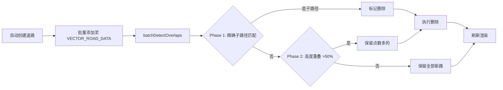
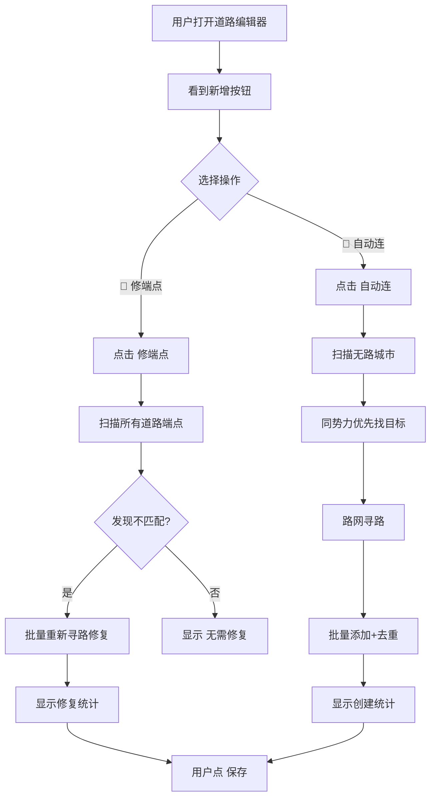

# 道路编辑器优化方案

## 一、架构概览与数据流

```mermaid
flowchart TD
    subgraph 数据层
        CITIES[src/data/cities_v2.ts<br/>CityDataV2[]]
        ROADS[src/data/VectorRoadData.ts<br/>FeatureCollection]
        FACTIONS[src/data/factions.ts<br/>Faction[]]
    end

    subgraph 图引擎
        RR[RoadRegistry<br/>节点+边图结构]
        RR_INIT[initialize<br/>注册城市节点+道路边]
        RR_DIJK[findPath<br/>城市间Dijkstra]
        RR_CONN[getConnectedCities<br/>查询连接城市]
    end

    subgraph 编辑器
        VRE[VectorRoadEditor]
        VRE_GEO[loadGeoJSONGraph<br/>加载NE路网图]
        VRE_DIJK[dijkstraGeo<br/>路网Dijkstra]
        VRE_GEN[generatePath<br/>创建道路]
        VRE_CHG[changeEndpoint<br/>修改端点]
        VRE_DEDUP[batchDetectOverlaps<br/>批量去重]
        VRE_SNAP[snapToExistingRoads<br/>吸附到已有路]
    end

    CITIES --> VRE
    CITIES --> RR_INIT
    ROADS --> VRE
    ROADS --> RR_INIT
    RR --> VRE
```

## 二、核心问题分析

### 2.1 城市坐标移动检测

当前 [`VectorRoadEditor`](src/core/VectorRoadEditor.ts:55) 中每条道路的 `startConnection` / `endConnection` 记录了关联的城市 ID，但道路的端点坐标（`geometry.coordinates[0]` 和 `coordinates[last]`）可能因为城市编辑器修改了城市坐标而变得过时。

### 2.2 缺失道路问题

`RoadRegistry.getConnectedCities()` 可以查询某城市连接了哪些城市。如果一个城市既不是任何道路的 `startConnection` 也不是 `endConnection`，它就是"无路城市"。

### 2.3 现有可用机制

- **`batchDetectOverlaps()`**（[`VectorRoadEditor.ts:1915`](src/core/VectorRoadEditor.ts:1915)）：两阶段去重（精确子路径匹配 + 高度重叠检查）
- **`changeEndpoint()`**（[`VectorRoadEditor.ts:265`](src/core/VectorRoadEditor.ts:265)）：修改道路端点并重新在 NE 路网上 Dijkstra 寻路
- **`generatePath()`**（[`VectorRoadEditor.ts:900`](src/core/VectorRoadEditor.ts:900)）：创建两个城市间的道路
- **`RoadRegistry.getConnectedCities()`**（[`RoadRegistry.ts:398`](src/core/RoadRegistry.ts:398)）：获取某城市直接连接的所有城市

---

## 三、新增方法设计

### 3.1 `fixEndpointMismatches()` — 修复端点不匹配

```typescript
/**
 * 扫描所有道路，检测并修复端点坐标与城市实际位置不匹配的问题。
 * 
 * 判定条件：道路首/末坐标 与 对应城市的坐标 之间的 Haversine 距离 > 阈值 (e.g. 5km)
 * 
 * 修复方式：对于不匹配的端点，调用 changeEndpoint() 逻辑重新在 NE 路网上寻路。
 * 但优化：不改变连接的城市 ID，只更新坐标。即重新 Dijkstra 然后替换 geometry.coordinates。
 * 
 * 算法伪代码：
 * 
 * function fixEndpointMismatches(thresholdKm = 5):
 *     fixedCount = 0
 *     for each road in VECTOR_ROAD_DATA.features:
 *         startCity = CITIES.find(road.startConnection)
 *         endCity = CITIES.find(road.endConnection)
 *         if not startCity or not endCity: continue
 *         
 *         firstCoord = road.geometry.coordinates[0]   // [lng, lat]
 *         lastCoord  = road.geometry.coordinates[last] // [lng, lat]
 *         
 *         startDist = haversine(startCity.lat, startCity.lng, firstCoord[1], firstCoord[0])
 *         endDist   = haversine(endCity.lat, endCity.lng, lastCoord[1], lastCoord[0])
 *         
 *         needsFix = false
 *         if startDist > thresholdKm:
 *             needsFix = true
 *             log "起点不匹配: {road.name} 起点距离城市 {startDist}km"
 *         if endDist > thresholdKm:
 *             needsFix = true
 *             log "终点不匹配: {road.name} 终点距离城市 {endDist}km"
 *         
 *         if needsFix:
 *             // 重新在 NE 路网上寻路
 *             if not geoGraphBuilt: await loadGeoJSONGraph()
 *             startCandidates = findKNearestGeoNodes(startCity.lat, startCity.lng, 5)
 *             endCandidates   = findKNearestGeoNodes(endCity.lat, endCity.lng, 5)
 *             
 *             bestPath = null
 *             for sc in startCandidates:
 *                 for ec in endCandidates:
 *                     path = dijkstraGeo(sc.id, ec.id)
 *                     if path and (!bestPath || path.totalDistance < bestPath.totalDistance):
 *                         bestPath = path
 *             
 *             if bestPath:
 *                 // 拼接城市坐标 + 路网路径
 *                 newCoords = [
 *                     [startCity.lng, startCity.lat],
 *                     ...bestPath.coordinates,
 *                     [endCity.lng, endCity.lat]
 *                 ]
 *                 // 后处理：去折角 + 抽稀 + 清理周边
 *                 cleaned = removeBacktracks(newCoords, 80)
 *                 simplified = simplifyCoords(cleaned, 0.002)
 *                 simplified = simplifyCityVicinity(simplified, startCity, endCity, 15)
 *                 
 *                 road.geometry.coordinates = simplified
 *                 roadRegistry.updateVectorRoadCoordinates(road.id, simplified)
 *                 fixedCount++
 *             else:
 *                 // 尝试桥接
 *                 bridged = findSmartBridgedPath(startCandidates[0].id, endCandidates[0].id)
 *                 if bridged: ...同样处理...
 *                 else: log "无法修复 {road.name}: 路网不可达"
 *     
 *     // 渲染更新
 *     renderAllRoads()
 *     updateRoadSelect()
 *     return fixedCount
 */
```

### 3.2 `autoCreateMissingRoads()` — 为无路城市自动创建道路

```typescript
/**
 * 扫描所有城市，找出没有任何道路连接到它们的城市（既不是 startConnection 也不是 endConnection），
 * 然后基于规则自动创建道路。
 * 
 * 连接规则（按优先级）：
 *   1. 同势力相邻城市优先（同 factionId 且距离最近的）
 *   2. 否则连接到最近的已有道路连接的城市
 * 
 * 安全约束：
 *   - 最大连接距离：500km（防止跨地图连接）
 *   - 每个新创建的道路都会调用 batchDetectOverlaps 去重
 *   - 批量操作整体执行，用户可确认后保存
 * 
 * 算法伪代码：
 * 
 * function autoCreateMissingRoads():
 *     // Step 1: 找出所有有路的城市
 *     connectedCities = new Set<string>()
 *     for each road in VECTOR_ROAD_DATA.features:
 *         if road.startConnection: connectedCities.add(road.startConnection)
 *         if road.endConnection:   connectedCities.add(road.endConnection)
 *     
 *     // Step 2: 找出无路城市
 *     orphanCities = CITIES.filter(c => !connectedCities.has(c.id))
 *     if orphanCities.length === 0: return "所有城市已有道路连接"
 *     
 *     // Step 3: 对每个无路城市，找到最佳连接目标
 *     newRoads = []
 *     for each orphan in orphanCities:
 *         target = findBestConnectionTarget(orphan, connectedCities)
 *         if target:
 *             // 在 NE 路网上寻路
 *             path = findPathOnGeoNetwork(orphan, target)
 *             if path:
 *                 newRoad = createRoadFeature(orphan, target, path)
 *                 newRoads.push(newRoad)
 *                 connectedCities.add(orphan.id)  // 允许链式连接
 *     
 *     // Step 4: 批量添加
 *     for each road in newRoads:
 *         roadRegistry.addVectorRoad(road)
 *     
 *     // Step 5: 去重
 *     batchDetectOverlaps()
 *     
 *     // Step 6: 刷新 UI
 *     renderAllRoads()
 *     updateRoadSelect()
 *     return newRoads.length
 * 
 * function findBestConnectionTarget(orphanCity, connectedCities):
 *     candidates = []
 *     
 *     // 优先级 1: 同势力相邻城市
 *     sameFactionCities = CITIES.filter(c => 
 *         c.factionId === orphanCity.factionId && 
 *         c.id !== orphanCity.id &&
 *         connectedCities.has(c.id)
 *     )
 *     for each candidate in sameFactionCities:
 *         dist = haversine(orphanCity, candidate)
 *         if dist <= MAX_CONNECTION_DIST_KM:
 *             candidates.push({ city: candidate, dist, priority: 1 })
 *     
 *     // 优先级 2: 最近的有路城市（不限势力）
 *     if candidates.length === 0:
 *         for each city in CITIES:
 *             if city.id !== orphanCity.id && connectedCities.has(city.id):
 *                 dist = haversine(orphanCity, city)
 *                 if dist <= MAX_CONNECTION_DIST_KM:
 *                     candidates.push({ city, dist, priority: 2 })
 *     
 *     // 按优先级 + 距离排序
 *     candidates.sort((a, b) => a.priority - b.priority || a.dist - b.dist)
 *     return candidates[0]?.city ?? null
 */
```

### 3.3 按钮与 UI 集成

在 [`VectorRoadEditor`](src/core/VectorRoadEditor.ts:238) 的 `createPanel()` 中已有的"批量处理按钮"区域新增按钮：

```typescript
// === 新增批量修复按钮 ===
const fixEndpointBtn = this.createButton('🔧 修端点', '#7c4dff', () => this.batchFixEndpoints());
const autoConnectBtn = this.createButton('🚧 自动连', '#00bcd4', () => this.batchAutoConnect());
this.panel.appendChild(fixEndpointBtn);
this.panel.appendChild(autoConnectBtn);
```

---

## 四、安全与防重复策略

### 4.1 多层保护

| 层级 | 措施 | 说明 |
|------|------|------|
| **前置** | `MAX_CONNECTION_DIST_KM = 500` | 避免连接跨地图的远距离城市 |
| **前置** | 跳过已有连接的城市 | 不重复创建 |
| **前置** | 跳过已有同起终点的道路 | `generatePath()` 已内置此检查（[`VectorRoadEditor.ts:1115`](src/core/VectorRoadEditor.ts:1115)） |
| **中置** | 自动道路创建后立即调用 `batchDetectOverlaps()` | 去重阶段1：精确子路径匹配；阶段2：高度重叠检查 |
| **后置** | 用户确认后再保存 | 所有自动操作会显示统计结果，用户可预览后点"保存"持久化 |

### 4.2 端点检测阈值

- **Haversine 距离阈值**: `5km`（约 0.045°）
- 考虑因素：城市编辑器可能将城市移动几公里到几十公里
- 如果阈值太小会漏检，太大则误报

### 4.3 去重流程



---

## 五、用户交互流程



---

## 六、实现注意事项

### 6.1 依赖注入

- 新增方法应利用已有的 `this.geoGraphBuilt`、`this.geoNodes`、`this.geoAdj` 等状态
- 如果路网图未加载，自动调用 `this.loadGeoJSONGraph()` 确保就绪
- 端点修复复用 `changeEndpoint()` 的核心逻辑（Dijkstra + 后处理）

### 6.2 性能

- 无路城市扫描：一次遍历即可，O(n) 其中 n 为城市数
- 端点检测：遍历所有道路端点，O(m) 其中 m 为道路数
- 路网寻路：每个无路城市最多执行 5x5=25 次 Dijkstra。如果无路城市很多（>20），建议加防刷机制
- **批量安全上限**：单次 `autoCreateMissingRoads()` 最多创建 20 条新路，超过提示分批

### 6.3 幂等性

- `fixEndpointMismatches()` 是幂等的：重复执行不会产生副作用（已修复的道路不会再次触发修复）
- `autoCreateMissingRoads()` 也是幂等的：已被连接的城市不会再次被处理
- `batchDetectOverlaps()` 执行后即可保证无重叠

### 6.4 错误处理

- 路网不可达时，尝试 `findSmartBridgedPath()` 桥接
- 桥接也失败时，跳过该城市，记录日志
- 批量操作不中断整体流程（失败的城市单独记录）

---

## 七、RoadRegistry 新增辅助方法

需要在 [`RoadRegistry`](src/core/RoadRegistry.ts:43) 中新增以下公共方法以供调用：

```typescript
/**
 * 判断一个城市是否有任何连接的道路
 */
public hasAnyRoad(cityId: string): boolean {
    // 检查 adjacencyList 中该城市是否有边
    const edges = this.adjacencyList.get(cityId);
    return edges !== undefined && edges.length > 0;
}

/**
 * 获取某个势力中所有有路的城市ID
 */
public getConnectedCitiesByFaction(factionId: string): string[] {
    return Array.from(this.nodes.values())
        .filter(n => n.type === 'city')
        .map(n => n.id)
        .filter(id => {
            const city = CITIES.find(c => c.id === id);
            return city && city.factionId === factionId && this.hasAnyRoad(id);
        });
}
```

> 注：`hasAnyRoad` 可以直接用 `getConnectedCities()` 返回数组长度 > 0 来判断，不必新增。而 `getConnectedCitiesByFaction` 是便捷方法。

---

## 八、详细方法签名

| 方法 | 可见性 | 参数 | 返回值 | 说明 |
|------|--------|------|--------|------|
| `batchFixEndpoints()` | private | 无 | `Promise<number>` | 修复条数 |
| `batchAutoConnect()` | private | 无 | `Promise<number>` | 创建条数 |
| `isEndpointMismatched(road, city, isStart)` | private | road, city, boolean | `boolean` | 判断端点是否匹配 |
| `findBestConnectionTarget(orphan, connectedSet)` | private | CityDataV2, Set\<string\> | CityDataV2 \| null | 找最佳连接目标 |
| `MAX_CONNECTION_DIST_KM` | private static | - | 500 | 最大连接距离常量 |

---

## 九、文件变更清单

| 文件 | 变更类型 | 说明 |
|------|----------|------|
| [`src/core/VectorRoadEditor.ts`](src/core/VectorRoadEditor.ts) | 修改 | 新增方法 + UI 按钮 |
| [`src/core/RoadRegistry.ts`](src/core/RoadRegistry.ts) | 可选 | 新增 `getConnectedCitiesByFaction()` 辅助方法 |

**不涉及**的文件：`VectorRoadData.ts`、`cities_v2.ts`、`factions.ts`
