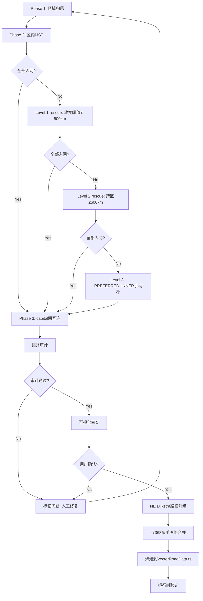

# 道路网设计方案 v2.0 — 评审与优化

> 基于 v1.0 方案 + 代码库深度审查后提出的优化版本
> 代码审查覆盖：`scripts/audit_radial_network.mjs`、`src/systems/RegionSystem.ts`、`src/data/cities_v2.ts`、`src/data/VectorRoadData.ts`、`src/core/RoadRegistry.ts`、`scripts/find-road.cjs`、`scripts/build_base_network.mjs`

---

## 一、审查结论

### 总体评价

v1.0 方案**方向正确，结构清晰**。3 层 hierarchy + 区内 BFS 的核心思路能有效解决当前单根 BFS 的跨文化区"抢人"问题。以下是我在深度审查代码库后发现的 7 个可优化点，以及对应的改进建议。

---

## 二、7 个优化建议

### 优化 1：Phase 2 算法从"贪心 BFS"升级为"约束 MST"

**现状分析**：

当前 v1.0 描述的 Phase 2 算法是贪心最近邻：

```
network = {capital}
for c in region.members:
  find c's nearest neighbor in network (≤333km)
  connect c to that neighbor
```

这是 Prim 算法的变体，但它**只考虑单跳最优**，可能产生次优拓扑。例如岭南区 55 个据点，贪心最近邻可能让花山直连广州（620km，超限），而实际最优路径是 花山→邕州（133km）→广州。

**建议**：改用 **Maximum Edge Length Constrained MST（最大边长的最小生成树）**

```
Phase 2 (改进):
  for each region in 14:
    candidates = []
    for each pair (a, b) in region.members ∪ {capital}:
      if dist(a, b) ≤ 333km AND not water-crossing:
        candidates.push({a, b, dist})
    
    // Kruskal / Prim 跑 MST, 只保留 ≤333km 的边
    mst = minimumSpanningTree(candidates)
    
    // 检查是否所有节点入网
    orphans = findDisconnected(mst)
    for orphan in orphans:
      // 尝试最近的跨区边 (Phase 3)
      // 或 fallback 到 PREFERRED_INNER
```

**优势**：
- MST 保证**总道路长度最优**（贪心最近邻不保证）
- MST 天然避免"花山直连广州 620km"问题，因为 花山→邕州(133km) 是更优边
- 比 BFS 更可预测、更可验证

---

### 优化 2：引入 Sub-Hub 机制解决大型区域的层级问题

**现状分析**：

| 区 | 据点数 | 地理跨度 |
|---|---|---|
| LINGNAN | 55 | 广州→桂林→邕州，三省+福建+越南 |
| JIANGNAN | ~50+ | 湘鄂赣浙皖，长江中下游 |
| NORTH | ~40+ | 河北山东晋北 |
| CENTRAL | ~40+ | 豫+关中 |

v1.0 的 Q4 已经意识到需要 sub-hub，但描述不够具体。

**建议**：对据点 ≥25 的 region，自动引入 sub-hub 层级

```
sub-hub 定义规则:
  1. 按 tier 选择: big_city / medium_city 优先
  2. 按历史行政中心: 如桂林(桂州)、邕州(邕州) 在岭南
  3. 按地理聚类: 用 k-means (k=ceil(N/15)) 自动聚类

算法流程:
  Phase 2a: 每个 sub-hub 管辖其聚类内的成员
  Phase 2b: sub-hub 连接到区 capital
  Phase 2c: capital 间互连 (同 Phase 3)
```

**regions with sub-hubs 建议**：

| 区 | Capital | Sub-hubs |
|---|---|---|
| LINGNAN | 广州 | 桂林、邕州 |
| JIANGNAN | 南京 | 江陵(荆州)、长沙、南昌、杭州 |
| NORTH | 北京 | 济南、太原 |
| CENTRAL | 洛阳+长安 | 开封、新郑 |
| DIANQIAN | 大理 | 昆明、贵阳 |
| STEPPE | 哈拉和林 | - (稀疏，不需要) |
| WESTERN | 龟兹 | 疏勒、高昌 |

---

### 优化 3：解决"孤儿检测"与 Phase 3 的 rescue 逻辑

**现状分析**：

v1.0 §8 提及"Phase 2 可能漏掉据点"，但 rescue 逻辑不够具体。某些区域（TIBET、WESTERN、STEPPE）据点间距确实可能 > 333km。

**建议**：明确定义 rescue pipeline

```
Orphan Rescue Pipeline:

Level 1 — 同区 rescue (Phase 2 内部):
  对于未能连接的据点:
    - 尝试连接到同区已有的任一节点 (不管距离)
    - 如果 dist ≤ 500km (放宽阈值), 直接连
    - 如果 dist > 500km, 标记为 Level 2 orphan

Level 2 — 跨区 rescue (Phase 3 扩展):
  对于 Level 1 仍孤立的据点:
    - 找最近的不同区节点 (距离不限)
    - 如果 dist ≤ 600km AND 有历史合理性 → 连接
    - 标记为 'inter_rescue' 类型

Level 3 — PREFERRED_INNER (手动):
  对于 Level 2 仍孤立的据点:
    - 需要手动添加 PREFERRED_INNER
    - 审计报告会列出所有 Level 3 orphans

Level 4 — 自动报告:
  输出 orphan 清单 + 距离 + 推荐 connection
  让用户决定是否接受或手动修复
```

---

### 优化 4：跨区边策略 — 推荐混合方案（B+）

**现状分析**：

v1.0 Q1 提出 A（严格不许跨区）vs B（1.5x 惩罚）。推荐 A。

**建议**：采用 **B+ 混合方案**

```
跨区边规则:
  1. Phase 3 (capital间): 允许跨区，上限 600km ✅
  2. 普通据点: 严格不许跨区 (除非是 Level 2/3 orphan rescue)
  3. 边界模糊区: 
     - 允许 BASHU↔DIANQIAN 边界据点跨区
     - 允许 JIANGNAN↔LINGNAN 边界据点跨区 (如湘桂边境)
     - 标记为 'cross_boundary' 类型，需要人工审核
  4. 所有跨区边在可视化中用特殊颜色 (如紫色)
```

理由：纯 A 方案在边界模糊区域（湘桂边境的麦岭关）会过于死板。混合方案用 PREFERRED_INNER 兜底边界 case，同时保持 mainline 的纯粹性。

---

### 优化 5：拓扑审计 → 可视化 → 烘焙的渐进流程

**现状分析**：

v1.0 §9 的实施步骤是正确的，但缺少一些关键的验证步骤。

**建议**：细化实施流水线

```
Step 1: 拓扑生成 (Phase 1-3, 输出 geojson)
  - 运行新算法
  - 输出 radial_network_v2.geojson (仅直线拓扑)
  - 不要修改 VectorRoadData.ts

Step 2: 拓扑审计 (自动)
  - 所有据点入网? → 统计 orphan
  - 三个 case 修复? → 麦岭关/永安/花山
  - 距离分布统计 → 最长/平均/P90/P99
  - 跨区边统计 → 数量/类型分布

Step 3: 可视化审查 (人工)
  - 在编辑器 Layer 4 加载 geojson
  - 黄线显示新拓扑
  - 标记有问题的连接

Step 4: PREFERRED_INNER 补齐
  - 根据审查结果补充
  - 重新运行 Step 1-2

Step 5: 路径升级 (直线 → 真实路径)
  - 对每条拓扑边，尝试 NE Dijkstra 寻路
  - 如果 Dijkstra 找到路径 → 保留完整坐标
  - 如果 Dijkstra 找不到 → 降级为直线 (待后续手动补)

Step 6: 与现有 363 条手画路合并
  - 检测同名 connection (相同 city pair)
  - 如果新拓扑 + 手画路都有 → 保留手画路坐标 + 新拓扑的 region 标签
  - 如果只有新拓扑 → 保留新拓扑
  - 如果只有手画路 → 保留手画路 (新算法遗漏的)

Step 7: 烘焙到 VectorRoadData.ts
  - 用户确认后执行

Step 8: 运行时验证
  - 加载到 RoadRegistry
  - 跑随机 city→city 寻路测试
  - 验证所有路径可达
```

---

### 优化 6：数据结构与代码组织建议

**现状分析**：

v1.0 §5.5 的数据结构基本合理，但缺少一些关键字段。

**建议**：

```typescript
// ===== 扩充的常量定义 =====

export interface RegionConfig {
  capital: string | string[];       // capital(s)
  subHubs?: string[];               // 子中心 (可选)
  minCitiesForSubHub?: number;      // 触发 sub-hub 的最小据点数
  allowCrossBorder?: boolean;       // 允许边界跨区
}

const REGIONAL_CONFIG: Record<RegionType, RegionConfig> = {
  CENTRAL: { capital: ['city_luoyang', 'city_changan'] },
  LINGNAN: { 
    capital: 'city_fanyu',
    subHubs: ['city_guilin', 'city_yongzhou'],  // 桂林、邕州
    allowCrossBorder: true,  // 湘桂边境
  },
  // ... 其他 12 区
};

// ===== 连接类型扩展 =====
enum ConnectionType {
  INTRA = 'intra',           // 区内连接 (普通)
  INTRA_SUB = 'intra_sub',   // member→sub-hub
  SUB_CAPITAL = 'sub_capital', // sub-hub→capital
  INTER = 'inter',           // capital→capital
  INTER_RESCUE = 'inter_rescue', // orphan rescue
  PREFERRED = 'preferred',   // PREFERRED_INNER
  CROSS_BOUNDARY = 'cross_boundary', // 边界跨区
}

// ===== 输出边 =====
interface Connection {
  from: string;        // city_id
  to: string;          // city_id
  distKm: number;
  type: ConnectionType;
  region?: RegionType;   // 仅 intra 系列
  sourceRegion?: RegionType;  // from 的区
  targetRegion?: RegionType;  // to 的区 (跨区时 != sourceRegion)
  subHub?: string;     // 所属 sub-hub (仅 INTRA_SUB)
}

// ===== PREFERRED_INNER 扩展 =====
// 允许透传更多信息
interface PreferredOverride {
  target: string;
  reason: string;       // 历史理由
  allowWater?: boolean; // 是否允许跨海
  type?: ConnectionType;
}

const PREFERRED_INNER_V2: Record<string, PreferredOverride> = {
  'city_gongbu': { 
    target: 'city_luoxie', 
    reason: '川藏南线起点，避开墨脱死胡同',
    type: ConnectionType.PREFERRED,
  },
  'city_tainan': { 
    target: 'city_qingjingsi', 
    reason: '闽台主航路（郑成功 1661 复台路线）',
    allowWater: true,          // 允许跨台湾海峡
    type: ConnectionType.PREFERRED,
  },
};
```

---

### 优化 7：新增 — 朝鲜海峡与对马海峡的水域检测

**现状分析**：

当前 `WATER_BODIES` 只定义了 `BOHAI_OPEN` 和 `TAIWAN_STRAIT`。但 KOREA↔JAPAN 之间需要过海连接（釜山→对马→壹岐→九州），这种历史航路应该允许。

**建议**：

```typescript
const WATER_BODIES = {
  // ... 现有
  
  // 朝鲜海峡 (釜山→对马): 不允许直接跨海
  // 但通过 PREFERRED_INNER + allowWater 可豁免
  KOREA_STRAIT: [
    { lat: 34.0, lng: 128.0 },
    { lat: 34.0, lng: 129.5 },
    { lat: 35.5, lng: 129.5 },
    { lat: 35.5, lng: 128.0 },
  ],

  // 对马海峡 (对马→壹岐): 不允许直跨
  TSUSHIMA_STRAIT: [
    { lat: 33.5, lng: 129.0 },
    { lat: 33.5, lng: 130.0 },
    { lat: 34.5, lng: 130.0 },
    { lat: 34.5, lng: 129.0 },
  ],
};

// 允许跨越上述海峡的 PREFERRED_INNER
const PREFERRED_INNER = {
  // ... 现有
  
  // 朝鲜-日本历史航路 (通过 PREFERRED 豁免跨海检测)
  'city_busan': { target: 'city_tsushima', reason: '朝鲜海峡航路', allowWater: true },
  'city_tsushima': { target: 'city_iki', reason: '对马海峡航路', allowWater: true },
  'city_iki': { target: 'city_dazaifu', reason: '九州航路', allowWater: true },
};
```

---

## 三、开放问题回答

### Q1：跨区边的处理策略？
→ **推荐 B+ 混合方案**（见优化 4）。允许边界跨区 + capital 间跨区，其余严格禁止。

### Q2：BFS 路径是直线还是 NE Dijkstra？
→ **先直线后 Dijkstra**（同意 v1.0）。直线用于拓扑验证，Dijkstra 用于烘焙阶段。在 `scripts/find-road.cjs` 和 `src/core/RoadRegistry.ts` 中已有成熟的 Dijkstra 实现，可以直接复用。

### Q3：VectorRoadData.ts 现有 363 条怎么办？
→ **推荐 C→A 渐进**（见优化 5 Step 6）。先合并保留手画路，确认新拓扑完整后再替换。**不要直接全量替换**，因为手画路包含真实曲线坐标，是经过人工校验的历史路径。

### Q4：区内子中心是否引入？
→ **必须引入**（同意 v1.0）。但有更具体的规则（见优化 2）：据点数 ≥25 的 region 自动引入 sub-hub，用地理聚类 + 历史中心双重判定。

### Q5：inter-region 单跳上限 600km 够吗？
→ **够**（同意 v1.0）。验证一下关键路径：
- 洛阳→长安 = 320km ✓ (intra)
- 长安→武威 = ~500km ✓ (inter)
- 武威→敦煌 = ~450km ✓ (inter, 实际 HEXI 区内)
- 敦煌→龟兹 = ~900km (需要两跳 via 哈密/高昌)
- 龟兹→撒马尔罕 = ~1100km (需要多跳)

洛阳→撒马尔罕全程约 3800km，按 600km/跳 需要 6-7 跳，符合丝绸之路上 actual 驿站数量。

### Q6：远东孤悬据点？
→ 审计会显示，Level 2 rescue 可救。NORTHEAST 区内部据点间距通常 < 300km（沿黑龙江、松花江分布），问题不大。

---

## 四、评审重点回应

### 算法正确性
3 层 hierarchy + 区内受限连接能有效避免 #4 的问题。但改 MST 比 BFS 更可控。

### 可扩展性 500→1000
完全不是问题。MST 复杂度 O(N²logN) 对 1000 节点绰绰有余。

| 规模 | Phase 2 距离计算 | 预计耗时 |
|---|---|---|
| 537 据点 | ~14 × (平均 38)² = ~20K | < 1s |
| 1000 据点 | ~14 × (平均 71)² = ~70K | < 2s |

### 数据驱动覆盖
`region` field + `PREFERRED_INNER` 可以覆盖 99% 案例。剩下 1% 的边界 case 通过 `CROSS_BOUNDARY` 类型标记 + 人工审核。

### 历史合理性
3 层 hierarchy 并非"中央集权"，而是对应古代实际的行政-驿道体系：
- super-hub（洛阳/长安）= 帝国驿道枢纽
- capital = 都督府/节度使驻地
- sub-hub = 州郡治所
- member = 县城/关隘

---

## 五、v2.0 实施步骤（更新版）



### 具体修改文件

| 文件 | 修改内容 |
|---|---|
| `scripts/audit_radial_network.mjs` | ✅ 主修改：MST + sub-hub + multi-level rescue |
| `scripts/classify_all_cities.mjs` | ✅ 对照更新 region 逻辑 |
| `src/data/cities_v2.ts` | ⚠️ 少量：补充 region override |
| `src/data/VectorRoadData.ts` | ❌ 暂不修改 (直到 Step 7) |
| `src/systems/RegionSystem.ts` | ❌ 可不动 (region 逻辑已完善) |
| `plans/道路网设计方案v2_评审优化.md` | **本文件** |

---

## 六、风险补充

| 风险 | 概率 | 影响 | 缓解措施 |
|---|---|---|---|
| MST 生成的拓扑在山区不符合历史驿道 | 中 | 中 | NE Dijkstra 路径升级会校正走向 |
| Sub-hub 选择争议 | 中 | 低 | 用 PREFERRED_INNER 调整 |
| KOREA↔JAPAN 跨海连接破坏游戏平衡 | 低 | 中 | 跨海边加高行军惩罚(×3) |
| 部分城市找不到任何 ≤333km 的邻居 | 中 | 高 | 多级 rescue pipeline |
| 手画路与 MST 拓扑冲突 | 低 | 中 | 手画路优先 (Step 6 合并规则) |

---

## 七、总结

v1.0 方案已经是一个**高质量、思路清晰**的设计文档。我的优化主要集中在：

1. **算法升级**：贪心 BFS → 约束 MST（更优拓扑）
2. **层级细化**：引入 sub-hub 机制（解决大区扁平化问题）
3. **rescue pipeline**：明确定义孤儿节点恢复流程（解决稀疏区问题）
4. **渐进式替换**：手画路不一次性删除（降低破坏性）
5. **数据结构扩充**：连接类型 + region config（更好追踪和调试）

以上是优化建议的全部内容。请审阅，如有疑问可以进一步讨论。
