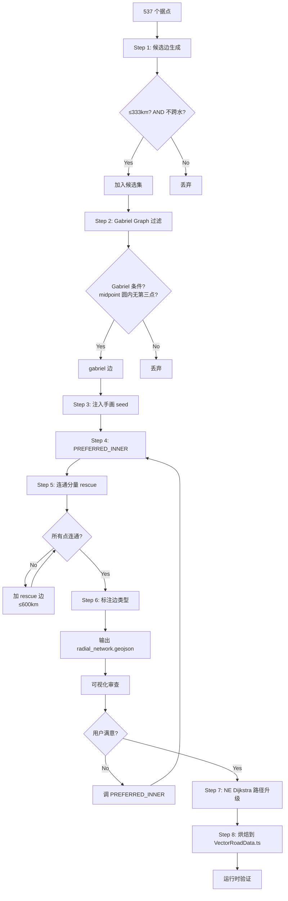

# 道路网设计方案 v3.0 — 最终实施计划

> 综合 AI #1（Gabriel Graph 网状拓扑）和 AI #2（工程实践细节）的评审意见
> 核心变动：放弃 Hub-and-Spoke 树状拓扑，改用 Gabriel Graph 平面网状拓扑

---

## 一、核心算法（一句话）

> 用 Gabriel Graph 在 537 据点上生成自然 mesh → 过滤 ≤333km + 不跨水 → 注入 363 条手画 seed → PREFERRED_INNER 兜底特例 → 跑 NE Dijkstra 升级几何 → 烘焙

---

## 二、旧方案遗留代码 — 需要修改的文件清单

### 🔴 文件 A：[`scripts/audit_radial_network.mjs`](scripts/audit_radial_network.mjs) — **主修改文件**

当前内容（v1.0 遗留） | 要改成（v3.0）
---|---
单根 BFS 从 {洛阳, 长安} 扩散 | ❌ 删除整个 BFS 主循环
`while (changed)` 循环 + `network` Map | ❌ 删除
`PREFERRED_INNER` 在 BFS 循环内嵌入处理 | ✅ 保留但重构为独立函数
`WATER_BODIES` + `crossesWater()` | ✅ 保留，Gabriel step 1 候选边过滤用
`ANCHORS = ['city_luoyang', 'city_changan']` | ❌ 删除（不再需要锚点概念）
`MAX_HOP_KM = 333` | ✅ 保留作为候选边过滤
`loadCities()` | ✅ 保留
`distKm()` | ✅ 保留
GEOJSON 输出 (radial_network.geojson) | ✅ 保留但输出格式升级
orphan 检测 | ✅ 保留但改为连通分量检测

**新代码结构**：

```
function main():
    cities = loadCities()
    
    // Step 1: 生成候选边 (≤333km + 不跨水)
    candidates = generateCandidates(cities)
    
    // Step 2: Gabriel Graph 过滤
    gabrielEdges = gabrielFilter(candidates, cities)
    
    // Step 3: 注入 363 条手画路
    manualEdges = loadManualSeeds()
    merged = mergeEdges(gabrielEdges, manualEdges)
    
    // Step 4: PREFERRED_INNER 兜底
    merged = applyPreferred(merged, cities)
    
    // Step 5: 连通分量 rescue
    final = rescueOrphans(merged, cities)
    
    // Step 6: 标注边类型
    final = annotateEdges(final, cities)
    
    // 输出
    outputGeoJSON(final, cities)
    printReport(final, cities)
```

---

### 🟡 文件 B：[`scripts/classify_all_cities.mjs`](scripts/classify_all_cities.mjs) — **对照更新**

当前内容（v1.0 遗留） | 要改成（v3.0）
---|---
14 区按 `getRegion(lat, lng)` 分组列出 | ✅ 保留，但用途变为**可视化校验**—检查 region 标注是否正确
无道路边关联 | ✅ 新增：并行输出"每个 region 连接到其他 region 的边数"，发现异常跨区

**修改幅度**：小。主要是加一个 cross-region edge 统计逻辑。

---

### 🟢 文件 C：[`scripts/build_base_network.mjs`](scripts/build_base_network.mjs) — **不改**

当前内容 | v3.0 状态
---|---
合并 NE 路网 + 手画路 → base_network.geojson | ✅ 保持不动。这是真实地形路网，给编辑器 Dijkstra 用的。新算法不碰它。

---

### 🟢 文件 D：[`src/systems/RegionSystem.ts`](src/systems/RegionSystem.ts) — **不改**

当前内容 | v3.0 状态
---|---
14 区 + `getCityRegion()` + UI 配色 | ✅ 保持不动。region 现在是纯视觉标签，不参与道路拓扑

---

### 🟡 文件 E：[`src/data/cities_v2.ts`](src/data/cities_v2.ts) — **少改（加 region override）**

当前内容 | v3.0 状态
---|---
`CityDataV2` 含 `region?: string` | ✅ 保持。少量补充 region override（边界模糊的据点）

**可能新增的 override**（根据分类脚本结果）：
- 麦岭关 → 手动设 `region: 'JIANGNAN'`（湘桂边境争议）
- 其他在审计中发现的边界争议点

---

### ❌ 文件 F：[`src/data/VectorRoadData.ts`](src/data/VectorRoadData.ts) — **暂不改（Step 7 烘焙时才改）**

当前内容 | v3.0 状态
---|---
363 条手画路（完整坐标） | ✅ 保留不动。Step 3 注入为 manual_seed edges。Step 7 合并后才替换。

---

### 🟢 文件 G：[`src/core/RoadRegistry.ts`](src/core/RoadRegistry.ts) — **不改**

当前内容 | v3.0 状态
---|---
运行时图引擎 + Dijkstra 寻路 | ✅ 保持不动。新道路拓扑最终烘焙入 VectorRoadData.ts 后，RoadRegistry 自动从那里加载

---

### 🟢 文件 H：[`scripts/find-road.cjs`](scripts/find-road.cjs) — **不改（但被 Step 6 调用）**

当前内容 | v3.0 状态
---|---
NE 路网 Dijkstra 寻路 | ✅ 保持。Step 6（路径升级）调用它把直线边转为真实地形路径

---

### 🟢 其他文件：所有 UI / 渲染 / 游戏逻辑文件 — **不改**

---

## 三、修改汇总表

| # | 文件 | 修改类型 | 工作量 | 说明 |
|---|---|---|---|---|
| 1 | [`scripts/audit_radial_network.mjs`](scripts/audit_radial_network.mjs) | 🔴 **重写** | ~300 行 | 删除 BFS，加 Gabriel + 手画 seed + rescue + 新输出格式 |
| 2 | [`scripts/classify_all_cities.mjs`](scripts/classify_all_cities.mjs) | 🟡 小改 | ~30 行 | 加跨区边统计 |
| 3 | [`src/data/cities_v2.ts`](src/data/cities_v2.ts) | 🟡 小改 | ~5 行 | 边界据点加 region override |
| 4 | [`src/data/VectorRoadData.ts`](src/data/VectorRoadData.ts) | ❌ **暂不改** | 0 行 | Step 7 烘焙时才改 |
| 5 | [`src/systems/RegionSystem.ts`](src/systems/RegionSystem.ts) | 🟢 不改 | 0 行 | |
| 6 | [`src/core/RoadRegistry.ts`](src/core/RoadRegistry.ts) | 🟢 不改 | 0 行 | |
| 7 | [`scripts/find-road.cjs`](scripts/find-road.cjs) | 🟢 不改 | 0 行 | Step 6 调用 |
| 8 | [`scripts/build_base_network.mjs`](scripts/build_base_network.mjs) | 🟢 不改 | 0 行 | |
| 9 | [`public/assets/radial_network.geojson`](public/assets/radial_network.geojson) | 🟢 自动生成 | 重新输出 | |

**总结：只需要重写 1 个文件 + 小改 2 个文件。**

---

## 四、实施步骤（7 步）

### Step 1：重写 [`scripts/audit_radial_network.mjs`](scripts/audit_radial_network.mjs)

```javascript
// ===== Step 1: 候选边生成 =====
function generateCandidates(cities) {
    const candidates = [];
    for (let i = 0; i < cities.length; i++) {
        for (let j = i + 1; j < cities.length; j++) {
            const a = cities[i], b = cities[j];
            const d = distKm(a, b);
            if (d > MAX_HOP_KM) continue;
            if (crossesWater(a, b)) continue;
            candidates.push({ a, b, dist: d });
        }
    }
    return candidates;
}

// ===== Step 2: Gabriel Graph 过滤 =====
// 边 (a,b) 存在 iff 不存在 c 使得 dist(c, midpoint(a,b)) < dist(a,b)/2
function gabrielFilter(candidates, cities) {
    // 用网格哈希加速: group cities by 3°×3° cell
    const grid = new Map(); // "cellX,cellY" → city[]
    for (const c of cities) {
        const cx = Math.floor(c.lng / 3);
        const cy = Math.floor(c.lat / 3);
        const key = `${cx},${cy}`;
        if (!grid.has(key)) grid.set(key, []);
        grid.get(key).push(c);
    }
    
    function getNearbyCities(midLng, midLat, radiusDeg) {
        // 返回半径 radiusDeg 内的所有 city
        // 用网格加速
    }
    
    const result = [];
    for (const { a, b, dist } of candidates) {
        const mid = { lng: (a.lng + b.lng) / 2, lat: (a.lat + b.lat) / 2 };
        const halfDist = dist / 2;
        const halfDeg = halfDist / 111; // 粗略转 degrees
        const nearby = getNearbyCities(mid.lng, mid.lat, halfDeg);
        let blocked = false;
        for (const c of nearby) {
            if (c.id === a.id || c.id === b.id) continue;
            if (distKm(mid, c) < halfDist - 0.1) { // -0.1km 容差
                blocked = true;
                break;
            }
        }
        if (!blocked) {
            result.push({ from: a, to: b, dist, type: 'gabriel' });
        }
    }
    return result;
}

// ===== Step 3: 注入手画路 seed =====
function loadManualSeeds() {
    // 加载 VectorRoadData.ts → 提取 startConnection → endConnection pairs
    // 返回 [{from, to, dist, type: 'manual'}]
}

// ===== Step 4: PREFERRED_INNER =====
function applyPreferred(edges, cities) {
    for (const [fromId, override] of Object.entries(PREFERRED_INNER)) {
        const from = cities.find(c => c.id === fromId);
        const to = cities.find(c => c.id === override.target);
        if (!from || !to) continue;
        // 如果已存在同 pair 的 gabriel/manual 边 → 覆盖 type 为 preferred
        // 如果不存在 → 新增
    }
}

// ===== Step 5: 连通分量 rescue =====
function rescueOrphans(edges, cities) {
    const graph = buildGraph(edges);
    const components = findConnectedComponents(graph, cities);
    if (components.length === 1) return edges;
    
    // 找主分量 (最大的)
    // 对其余分量: 找最近的主分量点 (≤600km) → 加 rescue 边
}

// ===== Step 6: 标注 =====
function annotateEdges(edges, cities) {
    return edges.map(e => ({
        ...e,
        sameRegion: getCityRegion(e.from) === getCityRegion(e.to),
    }));
}
```

### Step 2：跑审计

```
node scripts/audit_radial_network.mjs
```

期望输出指标：

| 指标 | 期望值 |
|---|---|
| 总边数 | ~1000-1200 |
| gabriel 边 | ~800-1000 |
| manual seed 边 | ~100-200（从 363 条中提取的 unique city pairs）|
| preferred 边 | ~5-10 |
| rescue 边 | ~0-5 |
| 同区边比例 | ~80-90% |
| 连通分量数 | **1** |
| P50 距离 | ~150-180km |
| P90 距离 | ~280-300km |
| 最长边 | ≤333km（除非 rescue/preferred） |

### Step 3：浏览器可视化审查

编辑器 Layer 4（黄线）已实现，刷新即可见。

检查要点：
- [ ] 跨海/穿山的不合理直线
- [ ] 孤立的据点（degree 0）
- [ ] 特别密集的区域边是否合理
- [ ] 麦岭关/永安/花山 三个 case 是否正确连接

### Step 4：加 PREFERRED_INNER

根据审查结果，补充 PREFERRED_INNER。候选列表：

```javascript
const PREFERRED_INNER = {
    'city_gongbu':      { target: 'city_luoxie',      reason: '川藏南线起点' },
    'city_tainan':      { target: 'city_qingjingsi',  reason: '闽台航路', allowWater: true },
    'city_mailingguan': { target: 'city_yongzhou_hn', reason: '湘桂走廊' },
    'city_yongan':      { target: 'city_lingqu',      reason: '桂林军管' },
    'city_huashan':     { target: 'city_yongzhou',    reason: '骆越→邕州' },
    // (未来) 釜山→对马岛→壹岐→太宰府 (跨海, allowWater)
};
```

### Step 5：更新 [`scripts/classify_all_cities.mjs`](scripts/classify_all_cities.mjs)

加一段逻辑：加载新生成的 `radial_network.geojson`，统计每个 region 的跨区边数。

### Step 6：NE Dijkstra 路径升级

对每条新边（非 manual_seed），调用 NE Dijkstra 寻路：

```
// 复用 scripts/find-road.cjs 的逻辑
// 或直接调用 RoadRegistry 的 dijkstraGeo()
for each edge in finalEdges:
    if edge.type === 'manual':
        continue  // 手画路已有真实坐标
    path = dijkstraGeo(edge.from, edge.to)
    if path:
        edge.coords = path.coordinates
    else:
        edge.coords = [edge.from.lng, edge.from.lat, edge.to.lng, edge.to.lat]  // 降级为直线
```

### Step 7：烘焙到 [`src/data/VectorRoadData.ts`](src/data/VectorRoadData.ts)

```javascript
// 合并规则:
// 1. 手画路 (manual) → 保留原坐标, 仅更新 metadata (type 标签等)
// 2. 新边 (gabriel/preferred/rescue) → 追加
// 3. 同名 city pair: 手画路优先覆盖新边
// 4. 输出 VectorRoadData.ts 格式 (FeatureCollection)
```

---

## 五、v3.0 算法流程图



---

## 六、Gabriel Graph 性能保证

对于 n=537 个据点：

| 阶段 | 算法 | 复杂度 | 预期耗时 |
|---|---|---|---|
| Step 1 候选边 | 双重循环 + 333km 过滤 | O(n × k) ≈ 537 × 150 = 80K | < 0.1s |
| Step 2 Gabriel | 网格哈希 + 局部检查 | O(E × k') ≈ 80K × 10 = 800K | < 0.5s |
| Step 3-6 | 线性扫描 | O(n + E) | < 0.1s |
| Step 7 Dijkstra | 每条边跑寻路 | O(E × m log m) ≈ 1000 × 10K log 10K | ~10-30s |
| **总计** | | | **< 1min** |

**关键优化**：Gabriel 条件不用暴力 O(n³)，而是用 3°×3° 网格分桶 + 只查局部邻域。这是可行的，因为 Gabriel 条件是"midpoint 圆内是否有第三点"，而这个圆的半径最多 = 333km / 2 ≈ 166km ≈ 1.5°，所以只需要检查邻近 3° 范围内的城市。

---

## 七、风险与缓解

| 风险 | 概率 | 影响 | 缓解 |
|---|---|---|---|
| Gabriel 在密集区边过多（中原 ~40 点/400km²） | 中 | 中 | 边密度 ≤ 4-6/点，实际可控。三维测试 |
| 部分城市 degree=1（西域/西藏） | 高 | 中 | Rescue edge + PREFERRED 补 |
| 手画路 363 条解析出错的 city pair | 低 | 低 | 日志 + 跳过失败项 |
| NE Dijkstra 找不到路径（降级为直线） | 中 | 低 | 直线降级，后期待手动补 |
| 新拓扑与原手画路视觉差异大 | 中 | 中 | Step 3 渐进合并，非一次性替换 |

---

## 八、最终确认

**本方案改动范围极小**：只重写 1 个审计脚本 + 小改 2 个辅助文件。现有游戏代码（RegionSystem、RoadRegistry、UI、渲染）完全不受影响。

确认后切换到 Code 模式实现 Step 1（重写 [`scripts/audit_radial_network.mjs`](scripts/audit_radial_network.mjs)）。
